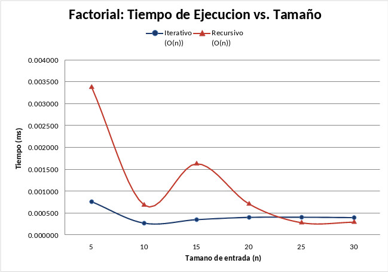
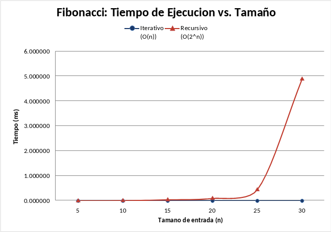
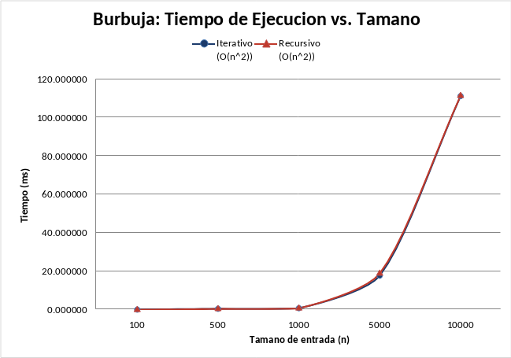

# Documentación Técnica 
# Algoritmos Iterativos vs. Recursivos

**Nombre:** Diego Lima
**Carné:** 202501852
**Asignatura:** Estructura de Datos
**Catedrático:** Ing. Brandon Chitay
**Universidad:** Da Vinci de Guatemala
**Fecha:**  Marzo 3 del 2026

---

## 1. ¿Qué es Big-O?

Big-O mide cómo crece el tiempo de un algoritmo cuando la entrada (n) aumenta:

- **O(n)** — si n se duplica, el tiempo se duplica.
- **O(n²)** — si n se duplica, el tiempo se cuadruplica.
- **O(2ⁿ)** — cada incremento de n duplica el tiempo.

---

## 2. Algoritmos implementados

**Factorial** — Calcula n! (ejemplo: 5! = 120). El iterativo usa un ciclo acumulador; el recursivo se llama con `n * fact(n-1)`. Ambos son **O(n)**.

**Fibonacci** — Calcula el n-ésimo término (0, 1, 1, 2, 3, 5, 8...). El iterativo usa dos variables que se desplazan en un ciclo. El recursivo llama a `fib(n-1) + fib(n-2)`, repitiendo cálculos y generando un árbol exponencial. Iterativo: **O(n)**, recursivo: **O(2ⁿ)**.

> **Explicación con mis palabras (Fibonacci recursivo):**
> Básicamente la función se llama a sí misma dos veces: una para calcular el número anterior y otra para el que está antes de ese. El problema es que eso se repite una y otra vez. Por ejemplo, si le pido `fib(5)`, para calcularlo necesita `fib(4)` y `fib(3)`. Pero `fib(4)` a su vez necesita `fib(3)` y `fib(2)`, y ahí ya está calculando `fib(3)` dos veces. Mientras más grande es n, más se repiten los cálculos y por eso se vuelve lentísimo. Es como si al buscar algo en una casa, cada vez que se abre un cajón se olvidara lo que ya se revisó y se volviera a empezar.

**Búsqueda Lineal** — Busca un valor recorriendo el arreglo. El iterativo usa un `for`; el recursivo avanza el índice en cada llamada. Ambos son **O(n)**.

**Burbuja** — Ordena comparando e intercambiando pares adyacentes. El iterativo usa dos ciclos anidados; el recursivo hace una pasada por llamada y reduce n en 1. Ambos son **O(n²)**.

> **Explicación con mis palabras (Burbuja iterativo):**
> Se tiene una fila de números desordenados. Lo que hace burbuja es comparar de dos en dos: se agarra el primero y el segundo, si el primero es más grande se intercambian, si no se dejan. Luego se pasa al segundo y tercero, y así hasta el final. Cuando termina esa pasada, el número más grande ya quedó al final. Entonces se repite todo el proceso pero ignorando el último (que ya está en su lugar). Así se van "burbujeando" los más grandes hacia la derecha en cada pasada hasta que todo queda ordenado. Por eso es O(n²): se tienen que hacer n pasadas y en cada una revisar hasta n elementos.

---

## 3. Fragmentos de código

### Factorial — Iterativo
```java
public static long iterativo(int n) {
    long resultado = 1;
    for (int i = 2; i <= n; i++) {
        resultado *= i;
    }
    return resultado;
}
```

### Factorial — Recursivo
```java
public static long recursivo(int n) {
    if (n == 0) return 1;
    return n * recursivo(n - 1);
}
```

### Fibonacci — Iterativo
```java
public static long iterativo(int n) {
    if (n == 0) return 0;
    if (n == 1) return 1;
    long anterior = 0, actual = 1;
    for (int i = 2; i <= n; i++) {
        long siguiente = anterior + actual;
        anterior = actual;
        actual = siguiente;
    }
    return actual;
}
```

### Fibonacci — Recursivo
```java
public static long recursivo(int n) {
    if (n == 0) return 0;
    if (n == 1) return 1;
    return recursivo(n - 1) + recursivo(n - 2);
}
```

### Búsqueda Lineal — Iterativo
```java
public static int iterativo(int[] arr, int valor) {
    for (int i = 0; i < arr.length; i++) {
        if (arr[i] == valor) return i;
    }
    return -1;
}
```

### Búsqueda Lineal — Recursivo
```java
private static int buscarRecursivo(int[] arr, int valor, int indice) {
    if (indice >= arr.length) return -1;
    if (arr[indice] == valor) return indice;
    return buscarRecursivo(arr, valor, indice + 1);
}
```

### Burbuja — Iterativo
```java
public static void iterativo(int[] arr) {
    int n = arr.length;
    for (int i = 0; i < n - 1; i++) {
        for (int j = 0; j < n - 1 - i; j++) {
            if (arr[j] > arr[j + 1]) {
                int temp = arr[j];
                arr[j] = arr[j + 1];
                arr[j + 1] = temp;
            }
        }
    }
}
```

### Burbuja — Recursivo
```java
private static void burbujaRecursivo(int[] arr, int n) {
    if (n <= 1) return;
    for (int j = 0; j < n - 1; j++) {
        if (arr[j] > arr[j + 1]) {
            int temp = arr[j];
            arr[j] = arr[j + 1];
            arr[j + 1] = temp;
        }
    }
    burbujaRecursivo(arr, n - 1);
}
```

---

## 4. Tabla de tiempos medidos

### Factorial y Fibonacci (n pequeño)

| Algoritmo | Versión | n=5 | n=10 | n=15 | n=20 | n=25 | n=30 |
|---|---|---|---|---|---|---|---|
| Factorial | Iterativo | 0.0006 ms | 0.0002 ms | 0.0004 ms | 0.0005 ms | 0.0003 ms | 0.0004 ms |
| Factorial | Recursivo | 0.0027 ms | 0.0006 ms | 0.0008 ms | 0.0022 ms | 0.0004 ms | 0.0004 ms |
| Fibonacci | Iterativo | 0.0005 ms | 0.0003 ms | 0.0003 ms | 0.0005 ms | 0.0004 ms | 0.0007 ms |
| Fibonacci | Recursivo | 0.0011 ms | 0.0087 ms | 0.0295 ms | 0.0758 ms | 0.4305 ms | 5.6688 ms |

### Búsqueda Lineal y Burbuja (n grande)

| Algoritmo | Versión | n=100 | n=500 | n=1,000 | n=5,000 | n=10,000 |
|---|---|---|---|---|---|---|
| Búsqueda Lineal | Iterativo | 0.0023 ms | 0.0066 ms | 0.0139 ms | 0.0900 ms | 0.0263 ms |
| Búsqueda Lineal | Recursivo | 0.0043 ms | 0.0035 ms | 0.0015 ms | 0.0439 ms | 0.0765 ms |
| Burbuja | Iterativo | 0.212 ms | 0.756 ms | 0.978 ms | 22.423 ms | 104.447 ms |
| Burbuja | Recursivo | 0.431 ms | 0.554 ms | 1.009 ms | 22.186 ms | 104.009 ms |

Tiempos promedio de 10 ejecuciones, medidos con `System.nanoTime()`.

---

## 5. Gráficas de rendimiento

### Factorial


Ambas líneas están prácticamente planas, los tiempos son casi cero (entre 0.0003 y 0.0035 ms). Hay algo de variación menor, como el recursivo arrancando un poco más alto en n=5, posiblemente por el costo inicial de las llamadas al stack de recursión y el calentamiento de la JVM, pero no afecta el comportamiento general. Ambas versiones son **O(n)**: hacen lo mismo, solo que una usa ciclo y la otra recursión.

### Fibonacci


Aquí se ve la diferencia más clara. El iterativo se queda pegado a cero, pero el recursivo se dispara a partir de n=25. Eso es **O(2ⁿ)**, crecimiento exponencial. En n=30 ya tarda casi 5 milisegundos mientras el iterativo ni se mueve.

### Búsqueda Lineal


Los tiempos son muy pequeños y muestran variación irregular, probablemente por ruido en las mediciones (JVM warmup, caché del procesador, posición del elemento buscado). Ambas versiones son **O(n)** en teoría, pero en la práctica los tiempos tan bajos hacen que el ruido domine la gráfica.

### Burbuja


Las dos curvas son casi idénticas y forman una parábola. De mil a diez mil elementos, el tiempo pasa de casi 0 ms a ~110 ms. Eso es **O(n²)**, crece con el cuadrado.

---

## 6. Conclusiones — Big-O experimental vs. teórico

| Algoritmo | Versión | Big-O experimental | Big-O teórico | ¿Coincide? | Justificación |
|---|---|---|---|---|---|
| A1 - Factorial | Iterativo | O(n) | O(n) | Sí | Gráfica plana, el tiempo apenas cambia al aumentar n |
| A1 - Factorial | Recursivo | O(n) | O(n) | Sí | Misma tendencia plana, ambos hacen n operaciones |
| A2 - Fibonacci | Iterativo | O(n) | O(n) | Sí | Se mantiene cerca de cero incluso en n=30 |
| A2 - Fibonacci | Recursivo | O(2ⁿ) | O(2ⁿ) | Sí | La curva explota a partir de n=25, crecimiento exponencial |
| A3 - Búsqueda Lineal | Iterativo | O(n) | O(n) | Sí | El tiempo sube proporcional al tamaño del arreglo |
| A3 - Búsqueda Lineal | Recursivo | O(n) | O(n) | Sí | Misma tendencia lineal ascendente que el iterativo |
| A4 - Burbuja | Iterativo | O(n²) | O(n²) | Sí | Parábola: 10x más datos = ~100x más tiempo |
| A4 - Burbuja | Recursivo | O(n²) | O(n²) | Sí | Curva casi idéntica al iterativo, misma parábola |

Todos los resultados experimentales coinciden con la teoría.

---

## 7. Análisis

**¿Por qué Fibonacci recursivo es mucho más lento que el iterativo?**
Porque cada llamada genera dos llamadas más, creando un árbol que repite los mismos cálculos. `fib(30)` hace ~2.7 millones de llamadas. El iterativo solo necesita 30 pasos.

**¿Qué significa O(n²) y cómo se ve en Burbuja?**
Que el tiempo crece con el cuadrado de n. En la gráfica se ve como una curva que sube cada vez más rápido: 10x más datos = 100x más tiempo.

**Si n se duplica, ¿cuánto aumenta el tiempo?**
- O(n): se duplica (×2)
- O(n²): se cuadruplica (×4)
- O(2ⁿ): crece de forma inviable

**¿Cuál es el costo de la recursión en memoria?**
Cada llamada recursiva se apila en la memoria hasta que llegue al caso base. Si n es muy grande, se acumulan demasiadas llamadas y Java lanza un error de memoria (`StackOverflowError`). El iterativo no tiene ese problema porque solo usa unas pocas variables sin importar el tamaño de n.

**¿Cuándo usar recursivo vs. iterativo?**
- Recursivo: problemas que se dividen naturalmente en subproblemas (árboles, grafos). Código más corto y legible. Ejemplo: explorar las carpetas de una computadora — cada carpeta puede contener más carpetas adentro, así que la función se llama a sí misma por cada subcarpeta que encuentra.
- Iterativo: cuando n es grande, se necesita eficiencia en memoria, o la recursión repite trabajo (como Fibonacci sin memoización). Ejemplo: sumar los precios de un carrito de compras — solo se recorre la lista de productos una vez con un ciclo, no tiene sentido usar recursión.

---

## 8. Referencias

- Oracle. *Java SE 21 — System.nanoTime()* — https://docs.oracle.com/en/java/javase/21/docs/api/java.base/java/lang/System.html#nanoTime()
- GeeksforGeeks. *Bubble Sort Algorithm* — https://www.geeksforgeeks.org/bubble-sort-algorithm/
- GeeksforGeeks. *Program for Fibonacci Numbers* — https://www.geeksforgeeks.org/program-for-nth-fibonacci-number/
- Baeldung. *Recursion in Java* — https://www.baeldung.com/java-recursion
- Big-O Cheat Sheet — https://www.bigocheatsheet.com/


<style>
  @page { size: letter; margin: 2.5cm; }
  body { font-family: "Segoe UI", Arial, sans-serif; font-size: 11pt; line-height: 1.6; color: #222; }

  /* Títulos */
  h1 { font-size: 20pt; color: #1a1a2e; border-bottom: 2px solid #1a1a2e; padding-bottom: 8px; page-break-after: avoid; }
  h2 { font-size: 15pt; color: #16213e; margin-top: 30px; border-bottom: 1px solid #ccc; padding-bottom: 4px; page-break-after: avoid; }
  h3 { font-size: 12pt; color: #0f3460; margin-top: 18px; page-break-after: avoid; }

  /* Texto */
  p, ul, ol { page-break-before: avoid; }
  hr { border: none; border-top: 1px solid #ddd; margin: 25px 0; }

  /* Imágenes (gráficas) */
  img { max-width: 85%; display: block; margin: 12px auto; page-break-inside: avoid; }

  /* Tablas */
  table { width: 100%; border-collapse: collapse; font-size: 9.5pt; margin: 15px 0; page-break-inside: avoid; }
  th { background-color: #1a1a2e; color: white; padding: 7px 8px; text-align: left; }
  td { border: 1px solid #ccc; padding: 5px 8px; }
  tr:nth-child(even) { background-color: #f2f2f2; }

  /* Código inline */
  code { background-color: #f0f0f0; padding: 2px 5px; border-radius: 3px; font-size: 9.5pt; }

  /* Bloques de código */
  pre {
    background-color: #1e1e1e;
    border-radius: 6px;
    padding: 14px 16px;
    margin: 10px 0;
    page-break-inside: avoid;
    overflow-x: auto;
  }
  pre code {
    background-color: transparent;
    color: #d4d4d4;
    font-family: "Consolas", "Courier New", monospace;
    font-size: 9pt;
    padding: 0;
    line-height: 1.5;
  }

  /* Citas) */
  blockquote {
    background-color: #f0f4ff;
    border-left: 4px solid #3b5998;
    margin: 12px 0;
    padding: 10px 16px;
    border-radius: 0 6px 6px 0;
    font-size: 10.5pt;
    page-break-inside: avoid;
  }
  blockquote strong { color: #1a1a2e; }
</style>